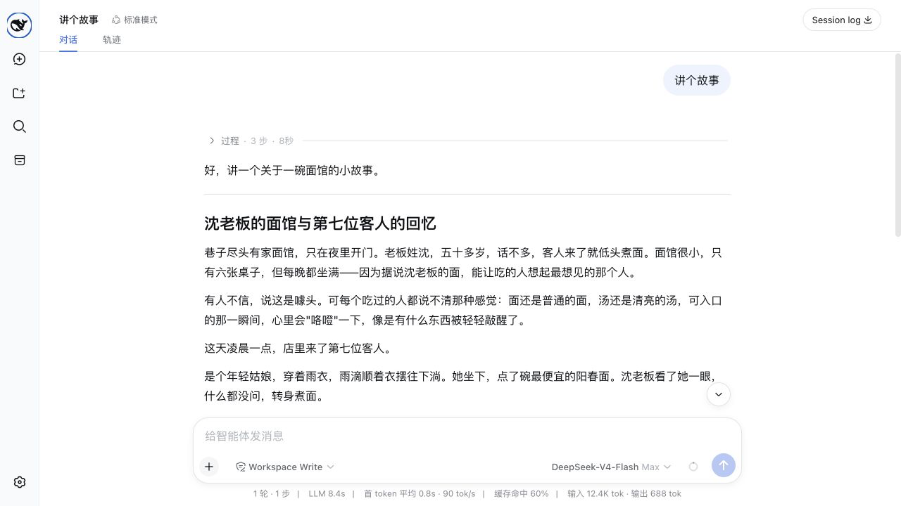
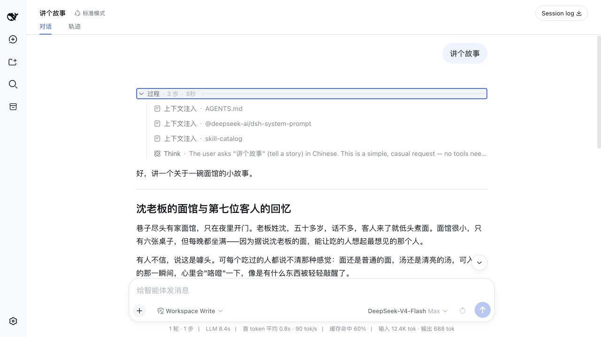

# DeepSeek Harness UX

English | [中文](README.md)

**Making long-running work in [DeepSeek Harness](https://github.com/deepseek-ai/deepseek-harness) easier to understand and follow.**

DeepSeek Harness UX is an unofficial community source edition. It does not rewrite how the Agent works; it focuses on the Web experience around live task progress, long answers, Session discovery, and produced files.

> This project is not an official DeepSeek distribution and does not receive upstream support. DeepSeek Harness and related names belong to their respective owners.

## What feels different

### 1. Reasoning and Tool steps no longer flood the conversation while a Session is running

While work is in progress, reasoning, context, commands, and Tool calls are collected into one stable **Process** area. You can see the current stage and elapsed time without searching through a stream of technical messages.

When display assistance is enabled, one small model request can also turn Todo, reasoning, and Tool evidence into simpler stage labels. That request changes presentation only; it never changes the Agent's answer.

### 2. The process folds when work finishes, returning attention to the answer

A successful task automatically folds its reasoning process so the final answer stays prominent. A failed or interrupted task remains open for inspection.

**After completion, the process folds automatically:**



**Open it again whenever you need the details:**



### 3. Long logs scroll on their own instead of dragging the whole conversation

Inside **Run details**, long command output and Tool logs use their own scrolling area. Reaching an edge does not unexpectedly move the entire conversation, and the sticky composer does not push the page into a large blank area.

### 4. Long answers are easier to read

Paragraphs, headings, and Turn boundaries use a tighter reading rhythm. After completion, optional display assistance can also improve answer headings; copied content, Session history, and the model-authored answer remain unchanged.

As work becomes idle, the browser repairs only the final slice of history in the background. A late end event does not leave the interface looking busy, and the page does not flash a new loading state.

### 5. Older Sessions are easier to find

Sessions default to **Last updated** ordering while Manual ordering remains available. The sidebar can search titles, Workspace names, and conversation content indexed in the current process; the Ungrouped section can also create a Session that belongs to no Workspace.

### 6. Produced files are easier to reach

Beyond files reported directly by successful tools, this edition recognizes clearly declared paths for documents, spreadsheets, datasets, images, media, archives, databases, and 3D/CAD files in the closing answer. Ordinary prose, URLs, commands, and code examples are not treated as files.

### 7. Model setup stays in one Settings page

First use leads to the complete **Settings → Models** card instead of maintaining a second simplified key dialog. Providers, models, API keys, and error recovery stay in one place.

## What remains unchanged

- The Agent loop, model routing, tools, permissions, sandbox, and Session Log continue to follow DeepSeek Harness behavior.
- Original reasoning, context, commands, and Tool evidence are retained under **Run details** rather than deleted.
- Display assistance does not modify the System Prompt, user message, tools, authored answer, or Session history.
- Session logs still stay local by default.

## Other differences from the official project

- This is a community edition built from an upstream source snapshot. It does not automatically receive later official fixes, compatibility updates, or security updates.
- The snapshot predates some later official features, including stricter cold-Session verification, hiding OAuth-only providers the current build cannot authenticate, and newer frame-wide UI extension points.
- There is no built-in Codex OAuth login or durable token refresh. Choosing the `openai-codex` route requires a manually supplied token.
- The base bundle installs dormant Codex and Claude Code subagent providers, but loading them does not start either product process.
- The official project publishes npm packages; this repository runs from source and publishes nothing under the `@deepseek-ai` scope.
- Current official source uses the MIT license; this fork retains the BSD 3-Clause license and notices of its upstream snapshot.

## Which version should I choose?

Choose DeepSeek Harness UX when the Web UI is your main workspace and you want clearer live progress, easier reading, better Session discovery, and more visible produced files.

Choose the [official DeepSeek Harness](https://github.com/deepseek-ai/deepseek-harness) when current official updates, npm installation, or Headless and CLI workflows matter more.

## Comparison basis

The UX feature source is based on [`35c6172`](https://github.com/ayuanwong/deepseek-harness-ux/commit/35c61722573f1357f0b5b7e2f687094fb6f7b097). This guide compares it with official commit [`47f9438`](https://github.com/deepseek-ai/deepseek-harness/commit/47f943859bef60e4160492346772ded9b24f765a) as reviewed on 2026-08-17. It describes user-visible differences as features and does not present tests, package metadata, or mechanical source-tree drift as product capabilities.

<a id="run"></a><a id="run-from-source"></a>

## Run from source

Requirements:

- Node.js `^22.19` or `>=24`
- pnpm 11
- A DeepSeek-compatible API key

```sh
git clone https://github.com/ayuanwong/deepseek-harness-ux.git
cd deepseek-harness-ux
pnpm install
pnpm run build
pnpm run dsh -- web --port 3081
```

Open `http://127.0.0.1:3081`, add a model provider under **Settings → Models**, then create a Session. Replace `3081` if the port is already in use.

This repository is a complete source edition. It is not a drop-in patch for a clean upstream checkout or a separately published npm plugin.

## Privacy

Do not commit `.env`, `.npmrc`, API keys, local Sessions, build output, or profile data. Review upstream telemetry settings before enabling a non-default telemetry mode. Display assistance uses the model provider configured for the current Session, so enabling stage or heading refinement sends a bounded projection of process evidence to that provider.

## Development

Read [AGENTS.md](AGENTS.md), the [development guide](docs/development.md), and [architecture](docs/architecture.md) before changing packages.

```sh
pnpm run lint
pnpm run build
pnpm run hygiene
pnpm run doc-sync
```

## Community links

- [](https://dshfind.com/zh/plugins/huiliyi37/dsh-tianshu-tui?ref=badge) — Interactive terminal UI with TDD, evidence checks, vision, and code-intelligence workflows.
- [](https://dshfind.com/zh/plugins/ccch1mneyyy/dsh-TUI?ref=badge) — Claude Code-style full-screen terminal UI with live task status, streamed reasoning, rollback, and context metrics.
- [](https://dshfind.com/zh/plugins/0xsline/awesome-deepseek-harness?ref=badge) — Curated DeepSeek Harness resources and ecosystem projects on DSH Find.

## License and attribution

This repository is derived from [DeepSeek Harness](https://github.com/deepseek-ai/deepseek-harness) and preserves the notices of its source snapshot. This tree uses the [BSD 3-Clause license](LICENSE); third-party dependencies and license terms are listed in [THIRD_PARTY_NOTICES.md](THIRD_PARTY_NOTICES.md).
